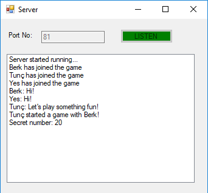
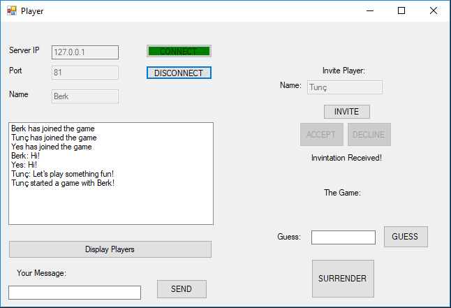

# Game-Lobby
A simple game lobby implementation for a group project(collaborated with Ömer Dai and Şevval Boylu) for the course Computer Networks with using C# Sockets.

In this project both server and client side were designed by us.

The main functionalities of this lobby are:
* Chat - when a client writes something to chat, it is broadcasted to all of the connected clients.
* Game invitation - there is a simple game inside the lobby to demonstrate the invitation mechanism where the server generates random numbers and the clients tries to guess it.

 

